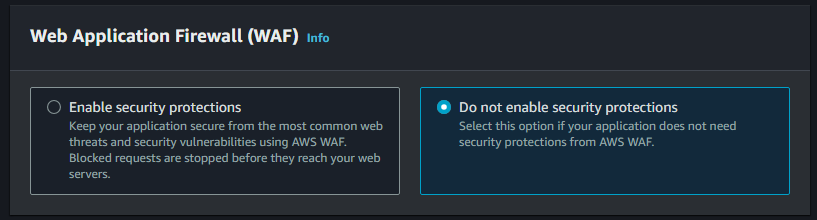

# Bước 1: Tạo DynamoDB
Truy cập [Dynamo DB](https://ap-southeast-1.console.aws.amazon.com/dynamodbv2/home?region=ap-southeast-1#tables), chọn **Create table**.


Đặt các cài đặt sau:
- **Table name**: KhachHang.
- **Partition key**: ma.

Ấn **Create table**.


Hoàn thành tạo **Dynamo DB**.

# Bước 2: Tạo Lambda Function
## Tạo Lambda Layer
Bước này giúp ta có thể thêm các dependencies cần thiết của **Lambda Function**.

### Chuẩn bị mã nguồn cho **Layer**
Ta truy cập [trang Lambda Function](https://ap-southeast-1.console.aws.amazon.com/lambda/home?region=ap-southeast-1#/layers). Ta chọn **Create layer**.
 

Tùy vào môi trường ta dùng để code mà sẽ có cách thêm **layer** khác nhau. Ta có thể tham khảo thêm ở [trang này](https://docs.aws.amazon.com/lambda/latest/dg/packaging-layers.html). Ở dự án này, ta sẽ xử dùng nodejs để phát triển trên **Lambda Function**. <br>

Truy cập folder chứa mã nguồn của **Lambda Function**
Ta tạo một tệp mới tên là **nodejs** và sao chép tệp **node_modules** và đặt nó vào trong tệp **nodejs** vừa tạo. Sau đó ta nén lại thành file zip. Folder sẽ có dạng <br>
**nodejs.zip**
  * nodejs/
    * node_modules/
      * dependenccies1/
      * dependenccies2/
      * ...
      * dependencciesN/


Thế là hoàn thành bước đầu tiên.

### Tạo **layer**.
Ta quay lại trang trên. Ta chọn **Create layer**.

**Name**: ta đặt tên cho **layer**.<br>
**Upload**: ta chọn **Upload a .zip file** rồi ấn **Upload** và tải file zip trên lên.<br>
**Compatible architectures - optional**: ta chọn **x86_64**.<br>
**Compatible runtimes - optional**: ta chọn **Node.js 20.x**.<br>
Sau đó ta ấn **Create**.


## Tạo Lambda Funciton
Ta truy cập [trang Lambda Function](https://ap-southeast-1.console.aws.amazon.com/lambda/home?region=ap-southeast-1#/functions) và chọn **Create function**.


### Khởi tạo Function.
Chọn **Author from scratch**. <br>
**Function name**: ta đặt tên cho function.
**Runtime**: ta chọn **Node.js 20.x**.
**Architecture**: ta chọn **x86_64**. <br>
**Change default execution role**: chọn **Use an existing role** và chọn Admin (tự tạo trước).


### Chuẩn bị mã nguồn cho Function.
Ta ấn vào **Layers**, trang web sẽ điều hướng ta đến phần **Layers**. Ta chọn **Add a layer**. 


Ở đây, ta chọn **Custom layers**, chọn **layers** ta vừa tạo ban nãy. Chọn **version** đầu tiên. Sau đó chọn **Add**.


Ở phần trên, ta chọn **Upload from** và chọn **.zip file**. Sau đó ta chọn tệp .zip chứa mã nguồn của lambda function. 


# Bước 3: Tạo Amazon API Gateway
## Tạo Restful API
### Khởi tạo API
Truy cập [trang API Gateway](https://ap-southeast-1.console.aws.amazon.com/apigateway/main/precreate?region=ap-southeast-1), chọn **Build** ở **REST API**.


Chọn **New API**.<br>
**API name**: đặt tên cho API.<br>
**API endpoint type**: chọn **Regional**.<br>
Sau đó ấn **Create API**.


Ta sẽ có giao diện sau:


### Khởi tạo resource
Ta chọn **Create resource**. Chọn tên cho đường dẫn, ở đây ta đặt tên là *khach-hang*. Sau đó bật **CORS (Cross Origin Resource Sharing)**. Sau đó chọn **Create resource**.


### Khởi tạo method
Ở **thuoc-tinh**, ta chọn **Create method**.


Ta sử dụng các cài đặt sau:
- **Method type**: **GET** <br>
- **Integration type**: **Lambda function** <br>
- **Lambda function**: **Lambda Function** tạo ở bước trước. <br>
- **Integration timeout**: giữ nguyên. <br>
- **Method request settings**: giữ nguyên. <br>
- **URL query string parameters**: giữ nguyên. <br>
- **HTTP request headers**: giữ nguyên. <br>
- **Request body**: giữ nguyên. <br>

Sau đó chọn **Create method**.


Ta chọn **Get** ở phần **/thuoc-tinh**, chọn **Integration request**, chọn Edit.


Thay đổi ở:<br>
- **Request body passthrough**: chọn **When there are no templates defined (recommended)**.<br>
- **Mapping templates**:
  1. Chọn **Add mapping template**.
  2. **Content type**: **application/json**.
  3. **Generate template**: **Method request passthrough**.<br>

Sau đó ấn **Save**.


Ấn **Test**, kết quả chạy ra như thế này thì thành công:


```
{"body":[],"message":"Success"}
```

Làm tương tự với các **Method** **PUT** , **POST**, **DELETE**. Sau khi xong, ta sẽ có giao diện:


Sau đó ta chọn **/khach-hang**, chọn **Enable CORS**.


Cài đặt:
- **Access-Control-Allow-Methods**: ta chọn hết.
- **Additional settings**
  - **Access-Control-Allow-Credentials**: chọn cái này.

Sau đó, ta ấn **Save**.


Về trang chính, ta ấn **Deploy API**. <br>
- Ở **Stage**, chọn **\*New stage\***.
- **Stage name**: đặt tên mình muốn.


Hoàn thành ta sẽ có như dưới. Ta copy Invoke URL và đặt nó vào trong dự án code.


# Bước 4: Tạo S3 Bucket
## Tạo S3 bucket
Vào [trang S3](https://ap-southeast-1.console.aws.amazon.com/s3/get-started?region=ap-southeast-1) để tạo một S3 bucket mới. Chọn **Create bucket**.


Các cài đặt ta sử dụng:
- **Bucket name**: userID-\<tên bucket\> (688567306327-dynamo).
- **Object Ownership**: **ACLs disabled (recommended)**.
- **Block Public Access settings for this bucket**: tắt **Block all public access**.

Các cái không đề cập thì sẽ giữ nguyên.


Sau khi tạo xong, ta truy cập vào bucket.


Chọn **Upload** và tải code trang web lên trên bucket.


Sau khi ấn upload và tải tệp tin lên, ta ấn **Upload**:


Sau khi tải xongn, ta vào phần **Properties**, kéo xuống cuối và chọn **Static website hosting**. Chọn **Edit**


Sau đó, ta để các cài đặt sau:
- **Static website hosting**: chọn **Enable**.
- **Hosting type**: **Host a static website**.
- **Index document**: **index.html**
- **Error document**: **index.html**

Sau đó ấn **Save changed**.


Sang **Permissions**, ta tìm **Bucket policy**, Ấn **Edit**.


Ta điền code ở dưới rồi ấn **Save changes**

```
{
  "Version": "2012-10-17",
  "Statement": [
    {
      "Sid": "Statement1",
      "Principal": "*",
      "Effect": "Allow",
      "Action": [
        "s3:GetObject"
      ],
      "Resource": [
        "arn:aws:s3:::userID-dynamo/*"
      ]
    }
  ]
}
```

Sau bước trên, ta có thể truy cập trang web thông qua url cung cấp ở chỗ **Properties**, **Static website hosting**


# Bước 5: Tạo CloudFront
Truy cập [CloudFront](https://us-east-1.console.aws.amazon.com/cloudfront/v4/home?region=ap-southeast-1#/welcome) và ấn **Create a CloudFront distribution**.


Đặt các cài đặt sau:
- **Origin domain**: `userID-dynamo.s3.ap-southeast-1.amazonaws.com`
- **Origin access**: `Origin access control settings (recommended)`
  - **Create new OAC**
- **Enable Origin Shield**: `Yes` - `ap-southeast-1`


- **Default cache behavior**:
  - **Viewer protocol policy**: `Redirect HTTP to HTTPS`
  - **Allowed HTTP methods**: `GET, HEAD, OPTIONS, PUT, POST, PATCH, DELETE`


- **Web Application Firewall (WAF)**: phụ thuộc vào tùy chọn bản thân.



- **Settings**:
  - **Price class**: `Use all edge locations (best performance)`
  - **Supported HTTP versions**: `HTTP/2` và `HTTP/3`


Sau đó, ta chọn **Copy policy** ở **The S3 bucket policy needs to be updated** và cập nhật nó ở **S3**.


Chọn **Error pages**, chọn **Create custom error response**


Cài đặt:


Thế là hoàn thành tất cả các bước thiết lập **cloudfront**